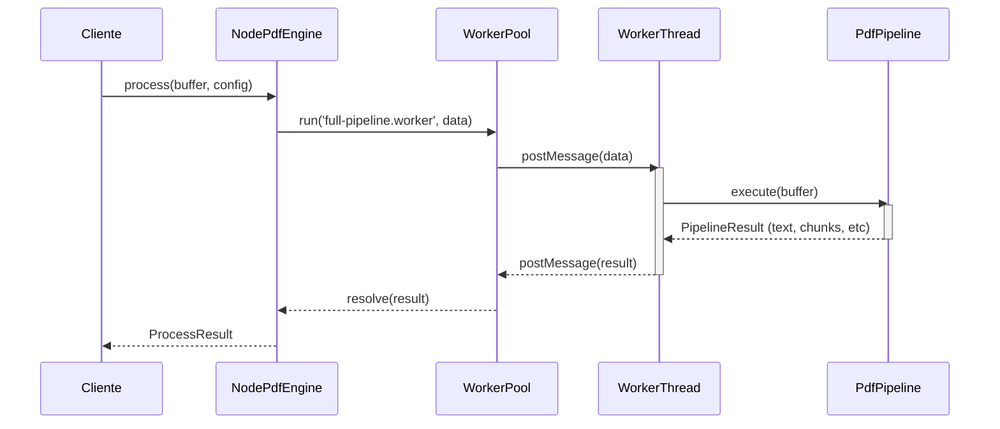
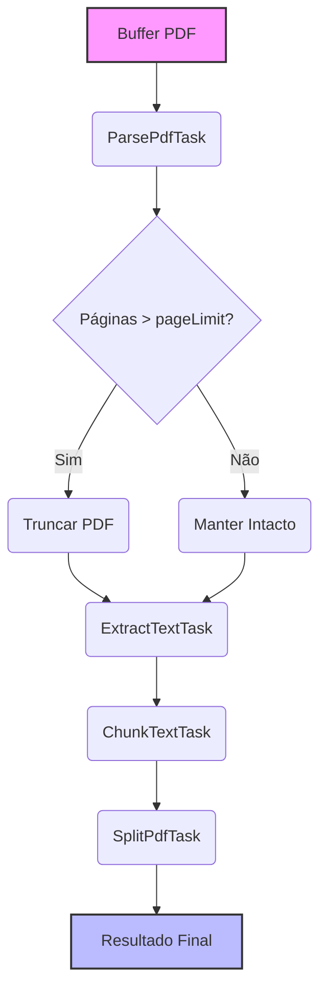
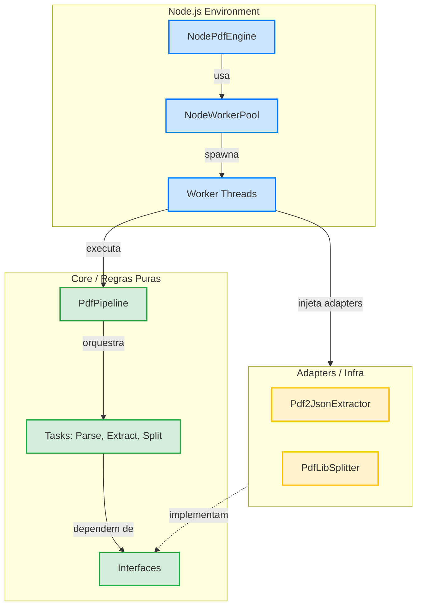

# pdf-engine-tools

[](https://www.npmjs.com/package/pdf-engine-tools)
[](https://opensource.org/licenses/MIT)

Processamento otimizado de PDFs com workers paralelos, extração de texto, detecção de assinaturas e split inteligente.

## Características

- **Workers paralelos** com ajuste automático de concorrência baseado em CPU
- **Clean Architecture** — core puro sem dependências externas
- **Extração de texto** otimizada via pdf2json
- **Split de PDFs** grandes em chunks via pdf-lib
- **Detecção de assinaturas** digitais
- **Facade `PdfEngine`** para API simplificada
- **TypeScript** com tipos completos

## Instalação

```bash
npm install pdf-engine-tools
```

## Uso rápido

```typescript
import { NodePdfEngine } from 'pdf-engine-tools';
import { readFileSync } from 'fs';

const engine = new NodePdfEngine();

const buffer = readFileSync('documento.pdf');
const result = await engine.process(buffer, {
  pageLimit: 12,
  maxChunkSize: 3000,
  timeout: 120000,
});

console.log(result.text);
console.log(result.pageCount);
console.log(result.isSigned);

await engine.shutdown();
```

## Fluxos de Funcionamento

### Processamento Principal (Sequência)



### Pipeline de Extração (Fluxo Interno)



## API

### `NodePdfEngine`

Facade principal — instancia adapters e worker pool internamente.

```typescript
const engine = new NodePdfEngine(logger?);

// Processar um PDF
const result = await engine.process(buffer, config);

// Combinar múltiplos resultados
const combined = await engine.processMultiple(results);

// Dividir PDF em partes
const split = await engine.split(buffer, 'upload-id', { chunkSize: 10 });

// Contar páginas (via worker)
const pages = await engine.getPageCount(buffer);

// Estatísticas do worker pool
const stats = engine.getStats();

// Shutdown
await engine.shutdown();
```

### Workers diretos

```typescript
import { NodeWorkerPool } from 'pdf-engine-tools';

const pool = new NodeWorkerPool();
const result = await pool.run('parse-pdf.worker.js', { buffer }, 60000);
await pool.shutdown();
```

### Split de PDF

```typescript
import { PdfLibSplitter } from 'pdf-engine-tools';

const splitter = new PdfLibSplitter();
const { chunks, totalParts } = await splitter.split(buffer, { chunkSize: 10 });
```

### Extração de texto

```typescript
import { Pdf2JsonExtractor } from 'pdf-engine-tools';

const extractor = new Pdf2JsonExtractor();
const result = await extractor.extract(buffer, { pageLimit: 20 });
console.log(result.text, result.isSigned, result.signatureDates);
```

## Configuração

### Variáveis de ambiente

| Variável | Padrão | Descrição |
|---|---|---|
| `PDF_CPU_USAGE_LIMIT` | `80` | Limite de CPU (%) |
| `PDF_MAX_WORKERS` | CPUs | Máximo de workers |
| `PDF_MAX_CONCURRENCY` | `min(CPUs-1, 4)` | Concorrência inicial |
| `PDF_QUEUE_MAX` | `100` | Tamanho da fila |

### `PdfProcessingConfig`

```typescript
{
  pageLimit?: number;        // Limite de páginas (default: 12)
  enablePageLimit?: boolean; // Ativar limite (default: true)
  maxChunkSize?: number;     // Tamanho do chunk de texto (default: 3000)
  timeout?: number;          // Timeout em ms (default: 120000)
  debug?: boolean;           // Logs de debug (default: false)
}
```

## Arquitetura (Clean Architecture)



Estrutura de diretórios:
```
src/
├── core/           # Regras puras — sem deps externas
│   ├── contracts/  # Interfaces: PdfParser, PdfSplitter, PdfTextExtractor, PdfChunker
│   ├── errors/     # PdfEngineError, PdfParseError, PdfWorkerError
│   ├── pipeline/   # PdfPipeline, PipelineExecutor
│   ├── tasks/      # ParsePdfTask, ExtractTextTask, SplitPdfTask, ChunkTextTask
│   └── types.ts
├── adapters/       # Implementações concretas
│   ├── pdf-lib/    # PdfLibSplitter (usa pdf-lib)
│   └── pdf2json/   # Pdf2JsonExtractor (usa pdf2json)
├── node/           # Node.js specific
│   ├── NodePdfEngine, NodeWorkerPool, NodeFsAdapter
│   └── buffer-utils
├── workers/        # Worker threads
│   ├── parse-pdf.worker.ts
│   ├── extract-text.worker.ts
│   └── full-pipeline.worker.ts
├── pdf-engine.ts   # Interface PdfEngine
└── index.ts
```

**Regra:** `core/` não conhece pdf-lib, pdf2json, worker_threads nem fs.

## Tratamento de erros

```typescript
import { PdfEngineError, PdfParseError, PdfWorkerError } from 'pdf-engine-tools';

try {
  await engine.process(buffer);
} catch (error) {
  if (error instanceof PdfParseError) {
    console.error(`Parse error [${error.code}]:`, error.message);
  } else if (error instanceof PdfWorkerError) {
    console.error('Worker error:', error.message);
  }
}
```

## Performance

| PDF | Páginas | Sequencial | Paralelo | Melhoria |
|---|---|---|---|---|
| 5MB | 50 | 2.5s | 0.8s | 3.1x |
| 20MB | 200 | 12.3s | 3.2s | 3.8x |
| 100MB | 1000 | 45.7s | 8.9s | 5.1x |

## Licença

MIT — [LICENSE](LICENSE)

## Autor

**Amilton Brune** — [@amiltonbrune](https://github.com/amiltonbrune)